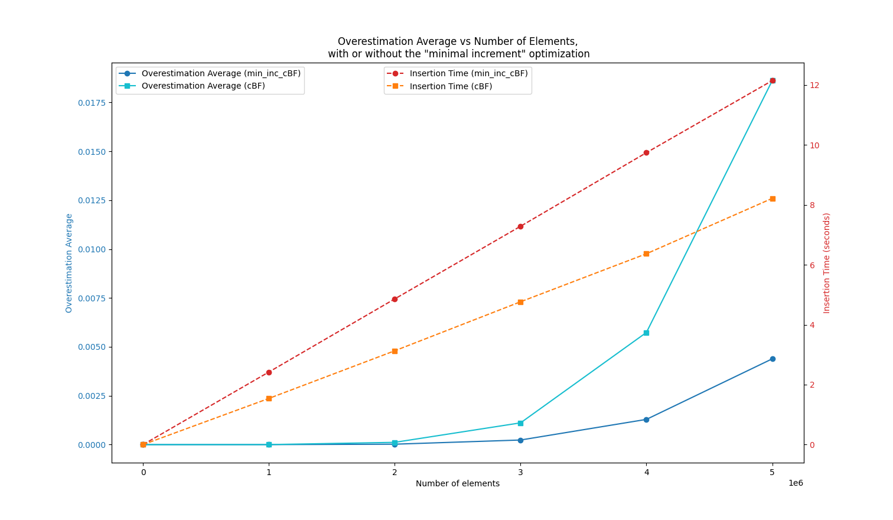

## Minimal increase counting bloom filter

---
**TL;DR** A simple way to reduce overestimations in counting Bloom filters.


### Context 
Bloom filters are probabilistic data structures used to test whether an element is a member of a set. A Bloom filter is an array of $m$ bits, initially all set to 0. It uses multiple (*k*) hash functions to map any element to $k$ addresses in the array. When inserting an element $x$, all the $k$ bits corresponding to the $k$ hash values of $x$ are set to 1.  
When checking the membership of an element $x$, if any of the $k$ corresponding bits is 0, the element is absent. Otherwise, it is reported as present, although this might be a false positive since the $k$ bits may have been set to 1 by other inserted elements.

Counting Bloom filters [1] extend Bloom filters by using $b$ bits per address instead of just one. This allows **1/** elements to be added and removed dynamically, and **2/** elements to be associated with their abundance (up to $2^b-1$). When an element is added, the counters at all the $k$ positions determined by the hash functions are incremented. To remove an element, the same counters are decremented. 

When an element $x$ is queried, the reported abundance associated with this element is equal to the minimum value stored at its $k$ corresponding addresses. Similar to false positives in Bloom filters, overestimations can occur in counting Bloom filters.

### Counting Bloom filter variants

There are numerous clever variants of the counting Bloom filter data structure. A comprehensive overview is provided in [2], which also introduces an interesting idea to limit overestimations.

These variants all have their pros and cons (as does the method I propose here). They often involve sophisticated algorithmic and/or hardware techniques.

### What I propose: "the minimal increase counting Bloom filter"
While preparing a lecture about counting Bloom filters, I wondered why "*When an element is added, the counters at **all** the $k$ positions determined by the hash functions are incremented*". The key word here is "all". Let me explain with an example using the classic counting Bloom filter.  


In this example with $k=2$, we inserted $a$, $b$, and $c$. The reported value of $a$ is 2, while it was inserted only once. It is overestimated because other elements, $b$ and $c$, share addresses with $a$. 

In the "minimal increase counting Bloom filter," when adding an element $x$ to a counting Bloom filter, only the minimal value(s) corresponding to this element are incremented. The example becomes: 


In this example, when inserting $b$, only the minimal value (0) is incremented, the other one (highlighted), is not modified. The query for $a$ is not overestimated because $b$ and $c$ modified only cells with minimal values. 

The **rationale** is that the value reported for a queried element is the minimum value of all its $k$ counters. Therefore, increasing non-minimal counters when inserting an element only increases the overall overestimation rate.

### Simplest code modification
Compared to all existing counting Bloom filter variants, this one is likely the simplest. 
We only modify the function for adding an element from:
```rust
pub fn add<T: Hash>(&mut self, item: &T) {
        let indices = self.hash_indices(item);
        for &index in indices.iter() {
            self.increment_counter(index);
        }
    }
```
to
```rust
 pub fn add<T: Hash>(&mut self, item: &T) {
        let mut min_value = self.max_value;
        let mut min_hashes = Vec::new();
        let indices = self.hash_indices(item);
        // collect hash values with minimal counters
        for &index in indices.iter() {
            let current_value = self.get_counter(index);
            if current_value < min_value {
                min_value = current_value;
                min_hashes = vec![index];
            } else if current_value == min_value {
                min_hashes.push(index);
            }
        }
        // increase the counter of these hash values only
        for &index in min_hashes.iter() {
            self.increment_counter(index);
        }
    }
```
(though I suspect a Rust expert could optimize this further).

### No free lunch
This modification has three main drawbacks:
- Adding an element takes slightly more time, as there are two passes on the counters, and binary-stored values need to be converted to integers.
- Adding an element is not parallelizable (since the minimum must be collected). 
- Decreasing the abundance of an element is no longer possible. For example: 


In this case, the abundance of $a$ is reported as 0, even though it was inserted once and never removed.

### Results

In this experiment, I created a Bloom filter with 50 million cells ($m=50000000$), using $k=7$ hash functions and storing $b=4$ bits per cell. I stored an increasing number of elements (random DNA words of length 31) in the filter (x-axis), with each element being inserted between 1 and 10 times (randomly).  
The results compare the "minimal increase counting Bloom filter" (*min_inc_cBF*) with a classical counting Bloom filter (*cBF*). 

The blue curves show the average overestimation rate when querying stored elements (no false positives here).  
We can see that the *min_inc_cBF* overestimation rate is 2 to 3 times smaller than that of the *cBF*. The orange curves show the indexing time, confirming the first drawback listed earlier.

Interestingly, for the usual ratio of $n/m < 0.1$ (where $n$ is the number of stored elements), the results highlight that this approach performs very well for these typical values, as shown in the zoomed-in view below:



### Prototype (Rust)
See [https://github.com/pierrepeterlongo/minimal_increment_CBF](https://github.com/pierrepeterlongo/minimal_increment_CBF)

### What's next?
We should improve the Rust code. Additionally, math enthusiasts could propose a formula to estimate the expected average overestimation rate based on $k$, $m$, $b$, and the number of stored elements and their abundances.

Please contact me if you're interested: pierre.peterlongo@inria.fr

### References

[1] Fan, Li, et al. "Summary cache: a scalable wide-area web cache sharing protocol." IEEE/ACM Transactions on Networking 8.3 (2000): 281-293.

[2] Rottenstreich, Ori, Yossi Kanizo, and Isaac Keslassy. "The variable-increment counting Bloom filter." IEEE/ACM Transactions on Networking 22.4 (2013): 1092-1105.